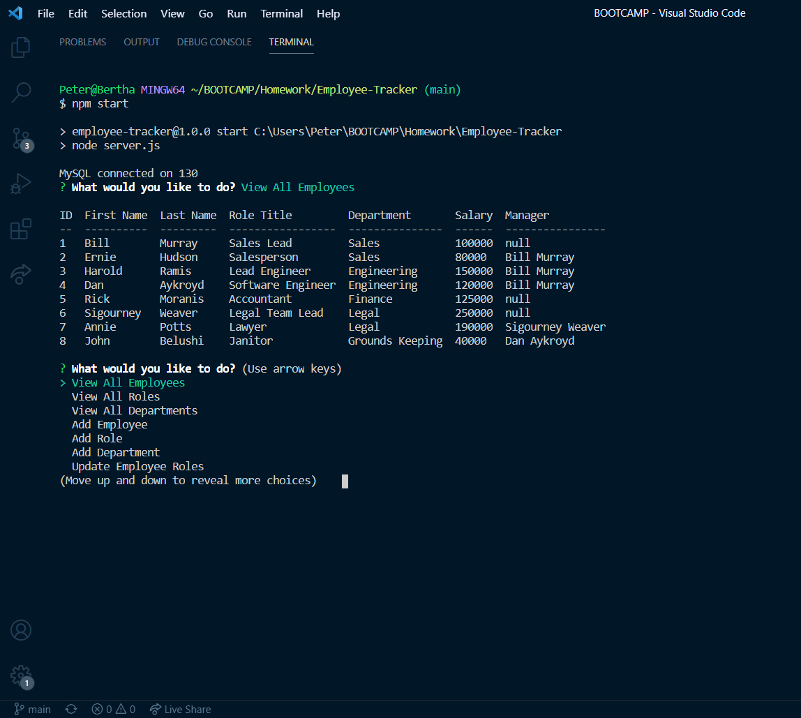

# Employee-Tracker



<br>

---

## Link

Here is a full video demonstration of how to use the application

https://drive.google.com/file/d/1dSbpE480FqtO0zB2zpskDObtYCUw7ntw/view?usp=sharing

Also here is a quick gif


<br>

---

## Description

A command-line application for managing a company's employees using node, inquirer, and MySQL

<br>

---

## Table of Contents

[Link](#link)

[Description](#description)

[Installation](#installation)

[Usage](#usage)

[Credits](#credits)

<br>

---

## Installation

1. Download and install node.js 

    * https://nodejs.org/en/

2. Download and install MySQL

    * https://dev.mysql.com/downloads/mysql

    * Instructions included for both Mac and Windows in ```./assets/mysql``` folder

3. Download and install MySQL Workbench

    * https://dev.mysql.com/downloads/workbench/

    * On same instructions as MySQL

3. Clone repository

    git clone https://github.com/Pete-Scale/note-taker.git

4. Open your terminal in the application file folder
    
    `./employee-tracker`

5. Install the node modules for the inquirer, mysql, and console.table packages
    ```
    npm install
    ```

<br>

---

## Usage

1. Create MySQL database

    * Sign in to MySQL either in Workbench or through the terminal

    * Open ```./db``` folder

    * Copy ```schema.sql``` file data and paste into MySQL Workbench and run code

    ***Note**: Do the same for ```seed.sql``` if you want silly Ghostbusters themed, starting employees*

1. Start the application
    ```
    npm start
    ```
    or

    ```
    node server.js
    ```
2. Move through the options using **UP ARROW** and **DOWN ARROW** and **ENTER** to make a selection 

    * You can **VIEW**, **ADD**, and **EDIT** all your **EMPLOYEES**, **ROLES**, and **DEPARTMENTS** to create your employee database

3. When you are done with the application choose the `Exit` option

    * You can always go to MySQL Workbench and view your new employee database

<br>

---

## Credits

Special thanks to Josh and the gang!

https://dev.mysql.com/downloads/mysql

https://dev.mysql.com/downloads/workbench/

https://www.npmjs.com/package/inquirer/v/0.2.3

https://www.npmjs.com/package/mysql

https://www.npmjs.com/package/console.table

https://javascript.info/task/array-negative

https://www.w3schools.com/sql/sql_foreignkey.asp